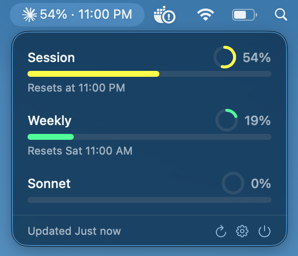

# ClaudeUsage

A macOS menu bar app that shows your Claude.ai subscription usage limits at a glance.



## Getting Started

1. **Download** the latest release from [GitHub Releases](https://github.com/linuxlewis/claude-usage/releases/latest) — grab `ClaudeUsage.zip`
2. **Unzip** and drag `ClaudeUsage.app` to your Applications folder
3. **Open** the app (first time: right-click → Open to bypass Gatekeeper since it's not code-signed)
4. **Click the gear icon** (⚙️) in the menu bar popover to open Settings
5. **Paste your credentials** (see below)
6. **Choose your time display preference** — show either reset time (e.g., "3:45 PM") or remaining time (e.g., "2h 15m")
7. **Hit Save**

That's it — your usage will appear in the menu bar within seconds.

### Getting Your Credentials

You need two things from claude.ai:

**Session Key:**
1. Go to [claude.ai](https://claude.ai) and sign in
2. Open Developer Tools (`⌘⌥I`)
3. Go to **Application** → **Cookies** → `https://claude.ai`
4. Copy the `sessionKey` value (starts with `sk-ant-sid`)

**Organization ID:**
1. In the same cookies list, find the `lastActiveOrg` cookie
2. Copy its value — that's your org ID

Paste both into the Settings panel and you're good to go.

## Building from Source

Requires macOS 13+ and Xcode 15+.

```bash
git clone https://github.com/linuxlewis/claude-usage.git
cd claude-usage
xcodebuild -scheme ClaudeUsage -configuration Release -destination 'platform=macOS' build
```

The app will be at:
```
~/Library/Developer/Xcode/DerivedData/ClaudeUsage-*/Build/Products/Release/ClaudeUsage.app
```

## Notes

- Uses an **unofficial, undocumented** Claude.ai API endpoint — may break at any time
- Session key is stored in the macOS Keychain; org ID in UserDefaults
- Usage refreshes every 5 minutes
- Menu bar shows the highest utilization percentage and time display (reset time or remaining time based on user preference)
- Supports multiple accounts — add, switch, and rename accounts from the popover or settings

## Disclaimer

This project is not affiliated with, endorsed by, or associated with Anthropic, PBC. "Claude" and "Anthropic" are trademarks of Anthropic, PBC. All trademarks belong to their respective owners. This is an independent, unofficial tool that uses undocumented APIs and may stop working at any time.
